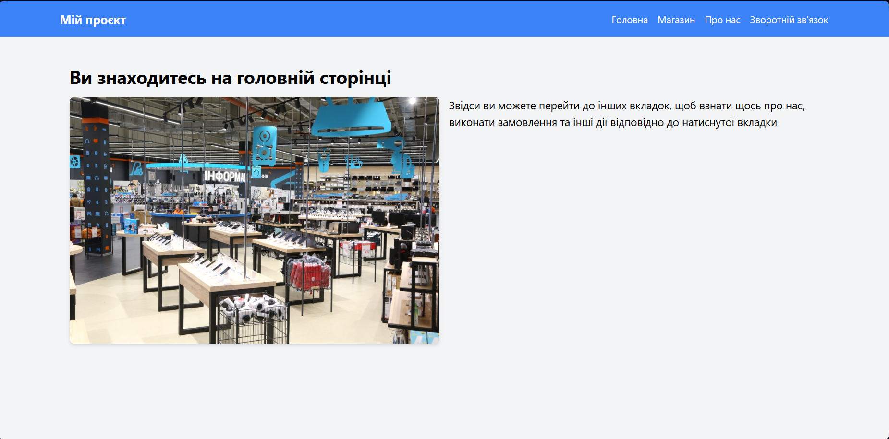
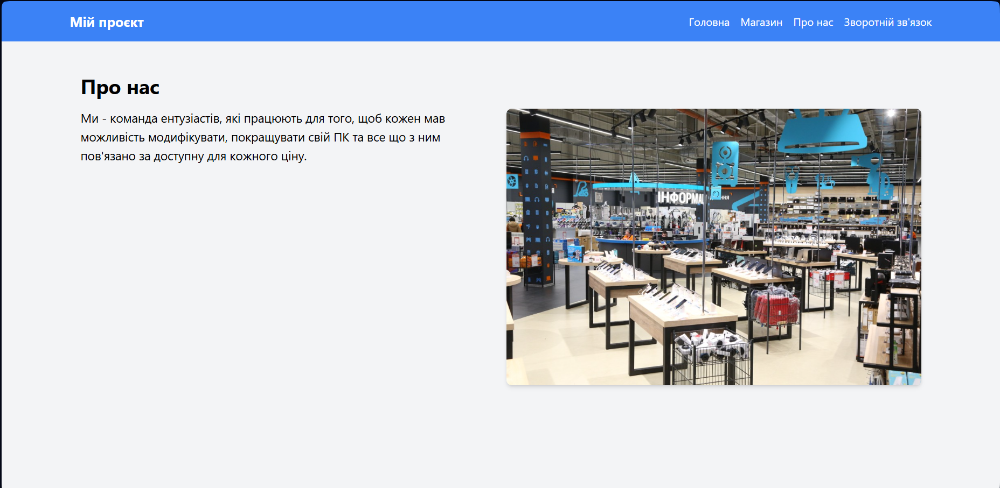

# Звіт з лабораторної роботи 3

## Розробка базового вебпроєкту

### Інформація про команду
- Назва команди: -

- Учасники:
  - Кучерук Максим Сергійович (кодер)

## Завдання

### Обрана предметна область

Каталог товарів в області техніки.

### Реалізовані вимоги

Вкажіть, які рівні завдань було виконано:

- [так] Рівень 1: Створено сторінки "Головна" та "Про нас"
- [так] Рівень 2: Додано мінімум дві додаткові статичні сторінки з меню та адаптивною версткою

## Хід виконання роботи

### Підготовка середовища розробки

Опишіть процес встановлення та налаштування:

- Версія Python - була встановленна попередньо
- Встановлення Flask - встановлений за допомогою команд у bsdh
- Інші використані інструменти - розширення для пайтона у VS Codeч

### Структура проєкту

Наведіть структуру файлів та директорій вашого проєкту:

```
website/
├── /lab-reports
│   ├── image-1.png
│   ├── image-2.png
│   ├── image-3.png
│   ├── image.png
│   └── lab03-report-MaxKucheruk-IPZ21.md
├── lab03-flaskProject/
│   ├── static/
│   │   └── b39b2493-1-15564.jpg
│   ├── templates/
│   │   ├── about.html
│   │   ├── base.html      
│   │   ├── HELP.html
│   │   ├── home.html
│   │   └── market.html
│   └── app.py  


### Опис реалізованих сторінок

#### Головна сторінка

Текст, Картинка, Функціонал:можливість переходу на інші сторінки

#### Сторінка "Про нас"

Текст, Картинка, Функціонал:можливість переходу на інші сторінки

#### Сторінка Зворотнього зв'язку

Текст, Картинка, Функціонал:можливість переходу на інші сторінки  

#### Сторінка магазину

Текст, Функціонал:можливість переходу на інші сторінки  

## Ключові фрагменти коду

### Маршрутизація в Flask

Наведіть приклад налаштування маршрутів у файлі `app.py`:

```python
@app.route('/HELP')
def helppage():
    return render_template('HELP.html')
```

### Базовий шаблон

Наведіть фрагмент базового шаблону `base.html`:

```html
<!DOCTYPE html>
<html lang="uk">
<head>
    <meta charset="UTF-8">
    <meta name="viewport" content="width=device-width, initial-scale=1.0">
    <title>Мій Flask проєкт</title>
    <script src="https://cdn.tailwindcss.com"></script>
    <style>
        @keyframes slideDown {
            0% { max-height: 0; opacity: 0; }
            100% { max-height: 300px; opacity: 1; }
        }
        @keyframes slideUp {
            0% { max-height: 300px; opacity: 1; }
            100% { max-height: 0; opacity: 0; }
        }
        .animate-slide-down {
            animation: slideDown 0.3s ease-out forwards;
        }
        .animate-slide-up {
            animation: slideUp 0.3s ease-in forwards;
        }
        .burger-line {
            transition: all 0.3s ease-in-out;
        }
        .open .line1 {
            transform: rotate(-45deg) translate(-5px, 6px);
        }
        .open .line2 {
            opacity: 0;
        }
        .open .line3 {
            transform: rotate(45deg) translate(-5px, -6px);
        }
    </style>
</head>
<body class="bg-gray-100">
    <nav class="bg-blue-500 p-4">
        <div class="container mx-auto flex justify-between items-center">
            <a href="/" class="text-white text-xl font-bold transition-transform duration-300 hover:scale-110">Мій проєкт</a>
            <div class="hidden md:flex space-x-4">
                <a href="/" class="text-white hover:text-blue-200 transition-colors duration-300 hover:underline">Головна</a>
                <a href="/market" class="text-white hover:text-blue-200 transition-colors duration-300 hover:underline">Магазин</a>
                <a href="/about" class="text-white hover:text-blue-200 transition-colors duration-300 hover:underline">Про нас</a>
                <a href="/HELP" class="text-white hover:text-blue-200 transition-colors duration-300 hover:underline">Зворотній зв'язок</a>
            </div>
            <button id="mobile-menu-button" class="md:hidden text-white w-6 h-6 relative focus:outline-none">
                <span class="burger-line block absolute h-0.5 w-6 bg-current transform transition duration-500 ease-in-out line1"></span>
                <span class="burger-line block absolute h-0.5 w-6 bg-current transform transition duration-500 ease-in-out line2"></span>
                <span class="burger-line block absolute h-0.5 w-6 bg-current transform transition duration-500 ease-in-out line3"></span>
            </button>
        </div>
        <div id="mobile-menu" class="hidden md:hidden overflow-hidden">
            <a href="/" class="block text-white hover:text-blue-200 py-2 transform transition duration-300 hover:translate-x-2">Головна</a>
            <a href="/market" class="block text-white hover:text-blue-200 py-2 transform transition duration-300 hover:translate-x-2">Магазин</a>
            <a href="/about" class="block text-white hover:text-blue-200 py-2 transform transition duration-300 hover:translate-x-2">Про нас</a>
            <a href="/HELP" class="block text-white hover:text-blue-200 py-2 transform transition duration-300 hover:translate-x-2">Зворотній зв'язок</a>
        </div>
    </nav>

    <div class="container mx-auto mt-8 p-4">
        
    </div>

    <script>
        const mobileMenuButton = document.getElementById('mobile-menu-button');
        const mobileMenu = document.getElementById('mobile-menu');

        mobileMenuButton.addEventListener('click', () => {
            mobileMenuButton.classList.toggle('open');
            if (mobileMenu.classList.contains('hidden')) {
                mobileMenu.classList.remove('hidden');
                mobileMenu.classList.add('animate-slide-down');
                mobileMenu.classList.remove('animate-slide-up');
            } else {
                mobileMenu.classList.add('animate-slide-up');
                mobileMenu.classList.remove('animate-slide-down');
                setTimeout(() => {
                    mobileMenu.classList.add('hidden');
                }, 300);
            }
        });
    </script>
</body>
</html>

## Розподіл обов'язків у команді

Опишіть внесок кожного учасника команди:

- Кучерук Максим Сергійович: Налаштування середовища для роботи, розархівування файлів прикріпленних у методичці, додавання 2 додаткових сторінок, налаштування попередньо розархівованого коду.

## Скріншоти

Додайте скріншоти основних сторінок вашого вебзастосунку:

  


    


### Головна сторінка


### Сторінка "Про нас"


### Додаткові сторінки


### Висновки

Опишіть:

- Що вдалося реалізувати успішно
- З якими труднощами зіткнулися
- Які навички та знання отримали
- Які можливості для вдосконалення проєкту бачите

Очікувана оцінка: [4-12 балів]

Обґрунтування: [Чому заслуговуєте на цю оцінку]
